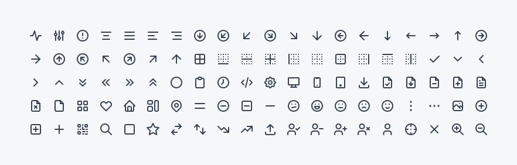

# Tabler Icons

A set of over 300 free MIT-licensed high-quality SVG icons for you to use in your web projects. Each icon is designed on a 24x24 grid and `2px` stroke.

```
npm install tabler-icons --save
```

## Preview




## Usage

All icons are built with SVG, so you can place them as ``, `background-image` and inline in HTML code.

### Inline HTML

```html
<a href="">
   <svg xmlns="http://www.w3.org/2000/svg" 
      class="icon tabler-icon tabler-icon-disabled" 
      width="24" height="24" viewBox="0 0 24 24" 
      stroke-width="1.25" stroke="currentColor" fill="none" 
      stroke-linecap="round" stroke-linejoin="round">...</svg>
   Click me
</a>
```

## Multiple strokes

All icons in this repository are drawn with the value of `stroke` property, so if you change its value you can get different variants of icon, that will fit into your project.


## License

Tabler Icons is licensed under the [MIT License](https://github.com/tabler/tabler-icons/blob/master/LICENSE).
